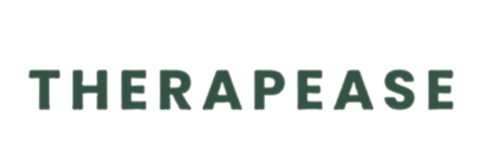

<p align="center" style="margin: 0;">
  
</p>


# TherapEase - Mental Wellness Platform

**TherapEase** is a mental wellness platform where users can easily book appointments with licensed therapists based on their needs. The platform offers flexible subscription packages, allowing users to choose what suits them best. This project is fully built with React, Tailwind CSS, Vite, and various other frontend tools, delivering a seamless and interactive user experience.

## Table of Contents
1. [Overview](#overview)
2. [Features](#features)
3. [Technologies Used](#technologies-used)
4. [Installation & Setup](#installation--setup)
7. [Contributors](#contributors)
8. [License](#license)

## Overview

**TherapEase** is designed to help users find the right therapist based on their specific mental wellness needs. It features an intuitive and responsive user interface with the following sections:

- **Landing Page**: An introduction to the platform, including a hero section, services overview, about us, how it works, testimonials, pricing, contact, and footer.
- **Therapist Booking**: Users can browse therapist options, choose a therapy package, and book sessions easily.
- **Subscription Plans**: Three flexible subscription plans with detailed package summaries.
- **Checkout & Payment**: A secure and simple payment flow for completing bookings.

## Features

- **Responsive Design**: Fully responsive layout using Tailwind CSS.
- **Interactive UI**: Smooth navigation and animations with Framer Motion.
- **Flexible Subscriptions**: Users can choose from three customizable subscription packages.
- **Booking System**: Simple and efficient therapist booking flow.
- **React Router**: For managing routes and navigation between pages.
- **React Tabs**: Used to toggle between different sections easily.
  
## Technologies Used

### Frontend:
- **React.js**: Component-based architecture for building dynamic user interfaces.
- **Vite**: Fast and modern build tool optimized for frontend development.
- **Tailwind CSS**: Utility-first CSS framework for responsive design.
- **Framer Motion**: Animation library for adding smooth transitions.
- **React Router**: For managing routes and navigation between pages.
- **React Tabs**: To manage content within different tabs.
- **React Icons**: For consistent and easy-to-use iconography.


## Installation & Setup

To run this project locally, follow these steps:

### Prerequisites
- Node.js (v14 or above)
- npm or yarn package manager

### Steps

1. **Clone the Repository**
   ```bash
   git clone https://github.com/hafsachenni/TherapEase.git
   ```

2. **Navigate to the project directory**
    ```bash
    cd TherapEase
    ```

3. **Install Dependencies**
```bash
npm install
```

4. **Start the Development Server**
```bash
npm run dev
```
- Then, the development server will be started at http://localhost:5173/


## Contributors:
Hafsa Chenni[https://github.com/hafsachenni]
